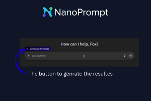
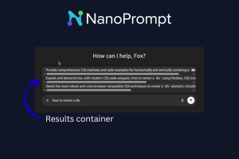
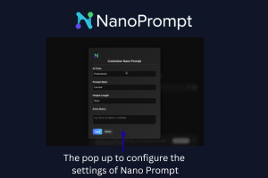

# Nano Prompt

I built **Nano Prompt** for the **Google Chrome Built‑in AI Challenge 2025** hackathon. I wanted a simple tool to improve prompt quality and get better AI responses without forcing users to learn prompt engineering.

---

## Demo

### Images :
   

### Youtube Demo :
[Video Link](https://www.youtube.com/watch?v=HMAv6ct_fcs)

---

## About

Nano Prompt enhances user input to produce clearer, more useful prompts for AI tools. It injects a small UI button into supported sites; clicking it shows improved prompt suggestions in a results container that can replace your input with a single click.

---

## Usage

Copy & paste these commands into your terminal:

```bash
git clone https://github.com/AhmedTalbii/NanoPrompte.git
cd NanoPrompte/backend
npm install
```

1. Rename `.envExample` to `.env` and add your Gemini API key from https://aistudio.google.com/api-keys
2. Start the backend:

```bash
node index.js
```

3. Load the frontend via the browser’s developer extension tools (Load unpacked extension -> point to the project folder).

---

This project was made By ❤️ developer : [AhmedTalbii](https://github.com/AhmedTalbii).